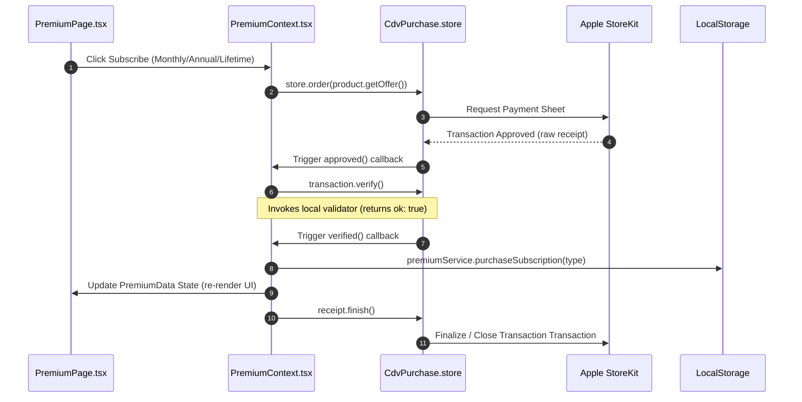

# Repo Link: 

https://github.com/its-me-ani/In-App-Purchase-IOS-MVP 


# In-App Purchase & Subscriptions Architectural Documentation

This document describes the offline-first In-App Purchase (IAP) and Subscription architecture implemented in the application using `cordova-plugin-purchase` (v13+) under Capacitor, along with an evaluation of its benefits, trade-offs, and technical design.

---

## 1. Architectural Design & Flow

The app is **100% offline-first**. All entitlements (premium status and remaining consumable credit units) are stored and managed locally on the device using `localStorage`.

### A. Component Interaction Flowchart

The diagram below shows the flow of data between the UI, the Capacitor React Context, the native plugin wrapper, StoreKit, and local persistent storage.

```mermaid
graph TD
    A["React UI Layer (PremiumPage)"] -->|1. Initiates Order| B["PremiumContext (React Provider)"]
    B -->|2. Resolves Offer / Calls order()| C["cordova-plugin-purchase (Capacitor Bridge)"]
    C -->|3. Initiates Apple Payment Sheet| D["iOS StoreKit / Apple App Store"]
    D -->>|4. Approved Transaction callback| C
    C -->|5. Triggers transaction.verify()| E["Local Receipt Validator (PremiumContext)"]
    E -->>|6. Callback ok: true| C
    C -->>|7. Triggers verified() callback| B
    B -->|8. Calls addCredits() / purchaseSubscription()| F["PremiumService"]
    F -->|9. Persists Entitlements| G["Local Storage (Device DB)"]
    G -->|10. Updates Context State| B
    B -->|11. Re-renders UI (Premium Active)| A
```

### B. Purchase & Entitlement Sequence Diagram

This sequence diagram outlines the chronological order of method calls during a subscription transaction.



---

## 2. Pros (Goods) vs. Cons (Bads) of this Approach

### Pros (Benefits)
1. **Zero Infrastructure Costs**: Since receipt validation is processed locally on the client and stored in `localStorage`, there is no need for a backend service (e.g., Node.js/Go backend) or specialized database (e.g., PostgreSQL).
2. **100% Offline Capability**: Subscriptions, credit balances, and restoration work perfectly without requiring an active internet connection (after the initial StoreKit payment process).
3. **Enhanced Privacy**: Users do not need to register accounts or sync email addresses, avoiding GDPR/data protection overhead.
4. **Clean Decoupling**: Browser simulation and native execution are completely separated, meaning developers can test payment UI in a standard web browser without mock store failures.

### Cons (Trade-offs & Vulnerabilities)
1. **Local State Tampering**: Because credit balances and subscription states are stored unencrypted in `localStorage` (`__pocket_budget_premium_data__`), rooted or jailbroken users can modify the values manually to unlock premium features without paying.
2. **No Cross-Device Sync**: If a user switches from an iPhone to an iPad, their subscription cannot be synced automatically unless they click the **Restore** button (which queries StoreKit receipts). Consumables (credit balances) cannot be restored across devices because Apple does not maintain purchase history for consumed items.
3. **No server-to-server validation**: There is no server checking the validity of the receipt against Apple's validation servers. If a user bypasses StoreKit locally (e.g. using LocalAPStore tweaks on jailbroken devices), the local validator will blindly approve the fake receipt.
4. **App Deletion Data Loss**: If a user deletes the app, all remaining consumable credit pack units (e.g., remaining PDF export credits) are lost permanently because they are only stored locally.

---

## 3. Tech Stack Integration Details

### A. The Billing Engine (`cordova-plugin-purchase`)
We use version 13+ of the Fovea billing plugin. The integration is initialized inside `PremiumContext.tsx` on mount when running on native platforms:
- **Product Types**: Matches product structures registered in App Store Connect (`ProductType.CONSUMABLE`, `ProductType.NON_CONSUMABLE`, and `ProductType.PAID_SUBSCRIPTION`).
- **Platform Agnostic**: Uses `Platform.APPLE_APPSTORE` inside the registration mapping to cleanly interface with StoreKit.

### B. Local Verification Loop
To support offline operation, the `store.validator` is configured with a custom local function:
```typescript
store.validator = (receipt: any, callback: any) => {
  callback({ ok: true });
};
```
This forces the plugin to transition a transaction from `approved` to `verified` immediately, allowing the app to trigger local state updates and call `receipt.finish()` without external network dependency.

### C. Xcode StoreKit Sandbox Environment
To test the transaction flows without billing real credit cards or logging into iTunes Sandbox accounts, the scheme is linked to a local `PocketBudgetStoreKit.storekit` file.
- **Auto-Renewing Subscriptions**: Set up inside a unified group `PocketBudgetSubscriptions` to test upgrade/downgrade logic.
- **Consumables & Non-Consumables**: Registered with local product IDs matching those declared in the codebase.
