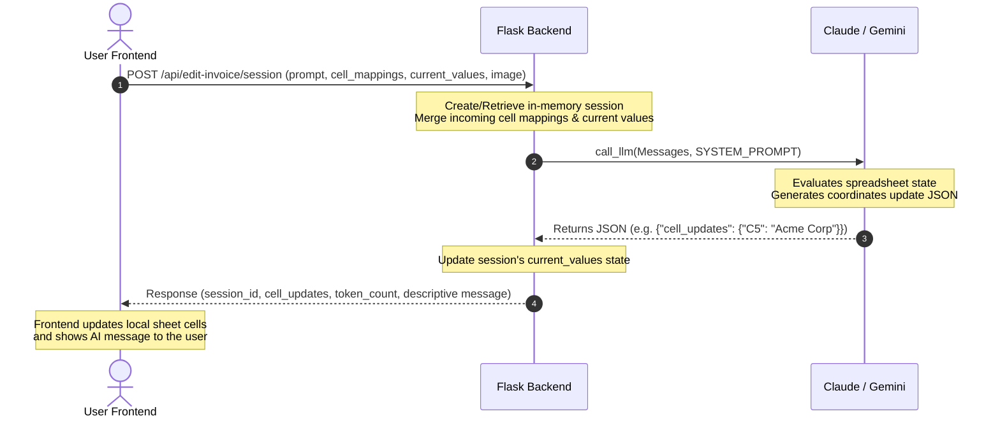
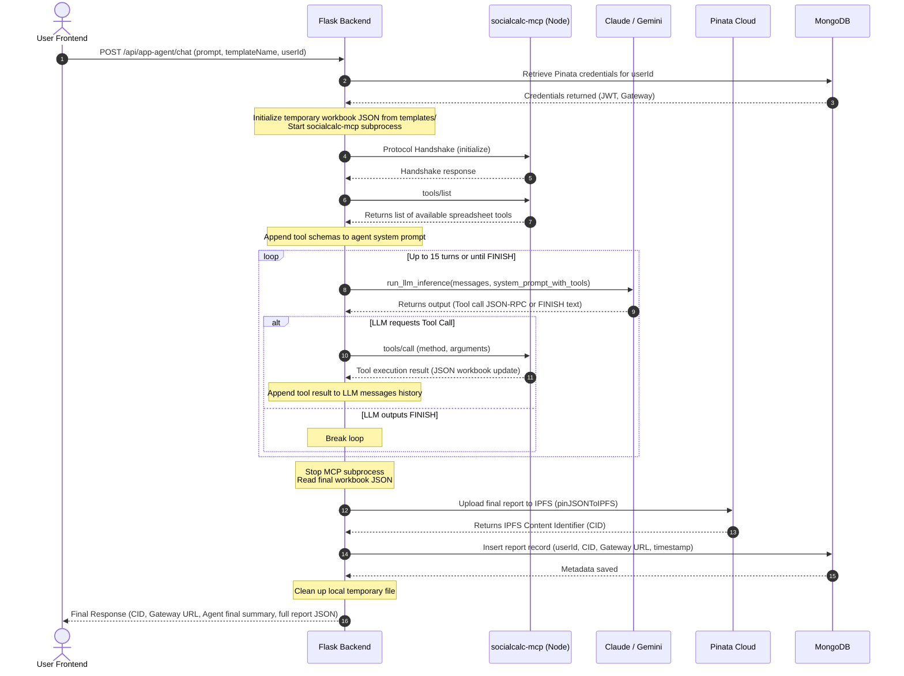

# Reference Repo

https://github.com/its-me-ani/Invoice-Agent-MVP 

# Invoice Suite Backend — Architecture & Developer Guide

This document describes the technical architecture, data flow, and components of the **Invoice Suite Backend**. For frontend details, see the main [ARCHITECTURE.md](file:///Users/anirudhsharma/Desktop/C4GT/0.%20Base%20App%20Codebase/ZKMedical-Billing/DMP'26/Invoice-Agent-Ipfs/ARCHITECTURE.md).

The backend folder is located at [backend/](file:///Users/anirudhsharma/Desktop/C4GT/0.%20Base%20App%20Codebase/ZKMedical-Billing/DMP'26/Invoice-Agent-Ipfs/backend).

---

## 🏛️ Overall Architecture Diagram

The backend acts as a middleware coordinator. It exposes REST endpoints to the frontend, manages in-memory editing sessions, invokes LLMs for reasoning, controls a Node.js-based MCP sub-process via standard JSON-RPC, and integrates with cloud networks (IPFS/Pinata) and databases (MongoDB).

```mermaid
graph TD
    %% Define main nodes and subgraphs
    subgraph Client ["Client Tier (Frontend)"]
        UI["React / Ionic App"]
    end

    subgraph Backend ["Application Backend (Python/Flask)"]
        API["Flask API Router\n(app.py)"]
        SessionStore["In-Memory Sessions\n(sessions = {})"]
        MCPClient["JSON-RPC MCP Client\n(MCPClient Class)"]
        LLMCoordinator["LLM Coordinator\n(run_llm_inference)"]
        IPFSConn["IPFS Connector\n(pin_json_to_ipfs)"]
    end

    subgraph Subprocess ["Local Subprocesses"]
        MCPServer["socialcalc-mcp Server\n(Node.js / npx)"]
    end

    subgraph LLM ["AI Engine (External APIs)"]
        Bedrock["AWS Bedrock\n(Claude 3.5 Sonnet)"]
        Gemini["Google Gemini API\n(Gemini 1.5 Pro)"]
    end

    subgraph Data ["Data & Storage Services"]
        Mongo["MongoDB\n(Credentials & Reports)"]
        Pinata["Pinata IPFS Cloud\n(Decentralized Storage)"]
    end

    %% Define connections
    UI <-->|HTTP POST / GET / DELETE| API
    API <-->|State Read/Write| SessionStore
    API <-->|Run Inference| LLMCoordinator
    API <-->|Manage Subprocess| MCPClient
    API <-->|Fetch/Save Metadata| Mongo

    MCPClient <-->|Stdio JSON-RPC\n(Stdin/Stdout pipe)| MCPServer
    LLMCoordinator -->|Primary API| Bedrock
    LLMCoordinator -->|Fallback API| Gemini

    IPFSConn -->|Pin Report JSON| Pinata
    API -->|Save CID URL| IPFSConn
```

---

## 🛠️ Technology Stack

| Layer | Component / Tool | Description |
|:---|:---|:---|
| **Framework** | **Flask** (v2.0+) | Python micro-framework for hosting the REST web service. |
| **CORS Utility** | **Flask-CORS** | Configures Cross-Origin Resource Sharing, allowing frontend requests from mobile/browser origins. |
| **Database** | **MongoDB & PyMongo** | Lazily initialized database connector to store encrypted IPFS credentials and generated reports. |
| **AI Integration** | **Boto3 (AWS Bedrock)** | Executes model inference against `anthropic.claude-sonnet-v1` (Claude 3.5 Sonnet) on AWS Bedrock. |
| **AI Fallback** | **Google Gemini API** | Used as an automated fallback if Bedrock credentials are missing or the API service fails. |
| **MCP Engine** | **Model Context Protocol** | Orchestrates interactions with spreadsheets by running `socialcalc-mcp` locally inside a node sub-process. |
| **Storage Gateway**| **Pinata Cloud (IPFS)** | Pins generated invoice sheet structures (JSON) to IPFS, returning immutable Content Identifiers (CIDs). |
| **Environment** | **python-dotenv** | Loads server configuration parameters and credentials from `.env`. |
| **Containerization**| **Docker / Docker Compose** | Multi-stage image build running Python 3.9-slim alongside Node.js 18. |

---

## 🔄 Core Workflows

The backend supports **two distinct modes** of operation for spreadsheet modification and AI assistance.

### 1. Real-Time Spreadsheet Assistant (Direct Cell Updating)

This mode is used during live editing. The LLM determines the changes based on a user's instructions and returns a list of cell coordinates to update. The frontend performs these updates directly on its local spreadsheet engine.



### 2. Autonomous Cloud Agent (MCP & IPFS Loop)

This mode operates as a fully autonomous agent loop. The backend starts the MCP server as a subprocess, copies the invoice workbook to a temporary file, and lets the LLM run a multi-turn tool calling sequence (up to 15 turns) to inspect, format, or write to the spreadsheet. Once done, the final file is uploaded to IPFS and logged to MongoDB.



---

## 📡 API Endpoints Reference

### Real-Time Spreadsheet Assistant

#### `POST /api/edit-invoice/session`
Initializes a new editing session (or updates the workspace values of an existing one).
*   **Request Body**:
    ```json
    {
      "session_id": "optional-uuid-string",
      "prompt": "Change client name to Stark Industries and add 5 repulsor units",
      "cell_mappings": {
        "clientName": "C5",
        "itemTable": { "rowStart": 21, "colDescription": "C", "colQty": "D", "colPrice": "E" }
      },
      "current_values": {
        "C5": "Acme Corp",
        "C21": "Vibranium Shield",
        "D21": "1"
      },
      "invoice_image": "data:image/jpeg;base64,...",
      "imageType": "image/jpeg"
    }
    ```
*   **Response**:
    ```json
    {
      "session_id": "session-uuid-string",
      "message": "Updated client name to Stark Industries and added 5 repulsor units in row 22.",
      "cell_updates": {
        "C5": "Stark Industries",
        "C22": "Repulsor Units",
        "D22": 5,
        "E22": 1500.0
      },
      "token_count": 850,
      "timestamp": "2026-08-06T00:50:00Z"
    }
    ```

#### `POST /api/edit-invoice/chat`
Continues the conversational interface for the given session. Keeps the history of previous messages intact.
*   **Request Body**: Same schema as `/session`, but `session_id` is **required**.
*   **Response**: Same schema as `/session`.

#### `GET /api/edit-invoice/session/<session_id>`
Retrieves session metadata, including active duration, token counts, and conversational history count.
*   **Response**:
    ```json
    {
      "session_id": "session-uuid",
      "created_at": "2026-08-06T00:45:00Z",
      "last_activity": "2026-08-06T00:50:00Z",
      "token_count": 1820,
      "message_count": 4
    }
    ```

#### `DELETE /api/edit-invoice/session/<session_id>`
Clears and deletes the session in-memory state.
*   **Response**: `{"success": true}` (HTTP 200).

---

### Cloud Agent & IPFS Management

#### `POST /api/app-agent/chat`
Triggers the multi-turn autonomous agent. Instantiates an MCP subprocess, loads the baseline template, lets the AI modify the sheet via the MCP client, pins the result to IPFS, and logs to MongoDB.
*   **Request Body**:
    ```json
    {
      "userId": "user_id_123",
      "prompt": "Create an invoice for Stark Industries with a Vibranium Shield priced at $500",
      "templateName": "100001",
      "image": "data:image/jpeg;base64,...",
      "imageType": "image/jpeg"
    }
    ```
*   **Response**:
    ```json
    {
      "cid": "bafybeiclk...",
      "name": "Invoice (2026-08-06)",
      "url": "https://gateway.pinata.cloud/ipfs/bafybeiclk...",
      "message": "The invoice was updated with Stark Industries as client and 1 Vibranium Shield.",
      "report": {
        "name": "Invoice (2026-08-06)",
        "id": "invoice_1770000000",
        "total": 0,
        "templateId": "100001",
        "content": { "msc": { ... } }
      }
    }
    ```

#### `GET /api/app-agent/credentials`
Retrieves a user's stored IPFS Pinata API credentials.
*   **Query Params**: `userId=string`
*   **Response**:
    ```json
    {
      "ipfsPinataJwt": "ey...",
      "ipfsPinataApiKey": "api_key",
      "ipfsPinataApiSecret": "api_secret",
      "ipfsGatewayUrl": "https://gateway.pinata.cloud/ipfs/"
    }
    ```

#### `POST /api/app-agent/credentials`
Stores or updates a user's Pinata IPFS credentials in MongoDB.
*   **Request Body**: Same schema as `GET` response, but including `userId`.
*   **Response**: `{"message": "IPFS credentials saved successfully in MongoDB"}`

#### `GET /api/app-agent/reports`
Lists all generated reports (including CID and URL) created by the specified user.
*   **Query Params**: `userId=string`
*   **Response**:
    ```json
    {
      "reports": [
        {
          "cid": "bafybeiclk...",
          "name": "Invoice (2026-08-06)",
          "url": "https://gateway.pinata.cloud/ipfs/bafybeiclk...",
          "date": "2026-08-06 00:50:00"
        }
      ]
    }
    ```

---

## ⚙️ Environment Variables

Copy the file [backend/.env.example](file:///Users/anirudhsharma/Desktop/C4GT/0.%20Base%20App%20Codebase/ZKMedical-Billing/DMP'26/Invoice-Agent-Ipfs/backend/.env.example) to `backend/.env` and configure the following parameters:

```bash
# MongoDB Configuration (optional, falls back gracefully if not specified)
MONGO_URI=mongodb://localhost:27017/
MONGO_DB=socialcalc_ai

# AWS Bedrock API Settings (Primary)
AWS_ACCESS_KEY_ID=your_aws_access_key
AWS_SECRET_ACCESS_KEY=your_aws_secret_key
AWS_REGION=us-east-1

# Google Gemini API Settings (Fallback)
GEMINI_API_KEY=your_gemini_api_key

# Port Configuration
PORT=5001
```

*   **Fallback Flow**: The application automatically routes LLM calls to **AWS Bedrock** (Claude 3.5 Sonnet). If the AWS credentials are not set, it falls back to the **Google Gemini API** (Gemini 1.5 Pro). If neither is configured, endpoints requiring AI inference return an error (HTTP 500).

---

## 🐳 Docker Deployment

The project is fully containerized. The `Dockerfile` compiles the required Node environment inside a Python image to support running the subprocess `socialcalc-mcp` wrapper.

### Build and Run locally with Docker Compose

At the root directory of the repository, execute:

```bash
# Build and run the services defined in docker-compose.yml
docker compose up --build
```

This starts:
1.  **Frontend** (accessible at `http://localhost:3000`)
2.  **Backend** (accessible at `http://localhost:5001`)

### Custom Dockerfile Explanation
The backend `Dockerfile` utilizes a standard `python:3.9-slim` base, then proceeds to overlay Node.js installation commands to ensure `npx` or `node` command executions from within Python code function correctly:
```dockerfile
FROM python:3.9-slim

# Install Node.js 18 & npm
RUN apt-get update && apt-get install -y curl && \
    curl -fsSL https://deb.nodesource.com/setup_18.x | bash - && \
    apt-get install -y nodejs && \
    rm -rf /var/lib/apt/lists/*

WORKDIR /app
COPY requirements.txt .
RUN pip install --no-cache-dir -r requirements.txt
COPY . .
EXPOSE 5001
CMD ["python", "app.py"]
```
