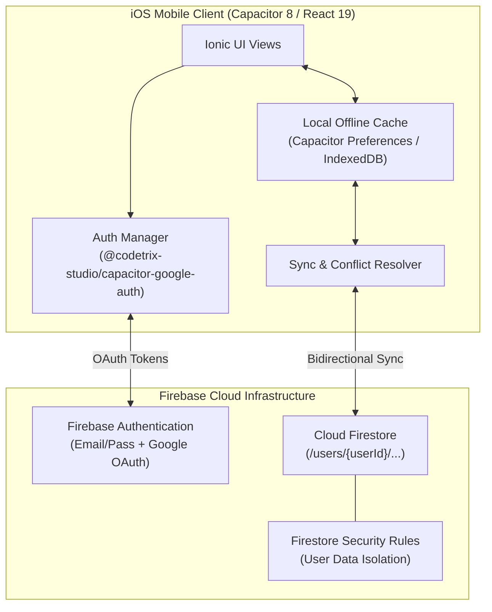
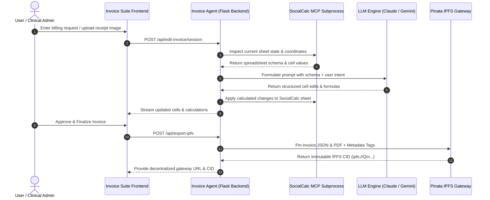

# 📅 Week 10 Progress Update: iOS Modernization, Firebase Cloud Sync & IPFS Invoice Agent

## 🔗 Reference Repositories
* 📦 **Invoice Agent IPFS MVP:** [https://github.com/its-me-ani/Invoice-Agent-MVP-IPFS](https://github.com/its-me-ani/Invoice-Agent-MVP-IPFS)
* 🔥 **iOS Firebase MVP:** [https://github.com/its-me-ani/IOS-Firebase-MVP](https://github.com/its-me-ani/IOS-Firebase-MVP)

---

## 🚀 Executive Summary

During **Week 10**, development was centered around three major milestones:
1. **Modernization & Upgrade of 4 iOS Applications** to modern, cutting-edge frontend and mobile runtimes (**Ionic 8 + React 19 + Vite + Capacitor 8**).
2. **Cloud Sync & Authentication Integration with Firebase** across mobile clients, including comprehensive offline-first testing and native iOS authentication.
3. **Enhancement of Invoice Agent for the IPFS Ecosystem**, upgrading decentralized document pinning, CID-based metadata tracking, and real-time spreadsheet AI automation via Model Context Protocol (MCP).

---

## 📱 1. iOS Applications Modernization & Upgrades

Four core applications were updated to use **Ionic 8**, **React 19**, **Vite build tooling**, and **Capacitor 8 native runtime**, delivering enhanced performance, smoother gesture handling, modernized UI styling, and updated bundle identifiers.

### 📊 Application Summary Matrix

| # | App Name | Bundle Identifier | Version & Build | Core Capabilities | Technology Stack |
|---|---|---|---|---|---|
| **1** | **Swimming Planner** | `com.aspiring.SwimmingPlanner` | `v2.0.0 (Build 1)` | Swim workout builder, lap time tracker, interval timer, drill planner | **Ionic 8 + React 19 + Vite + Capacitor 8** |
| **2** | **Weight Loss Pal** | `com.aspiring.WeightLossPal` | `v5.0.0 (Build 1)` | Weight milestones, body measurements, caloric deficit tracker, trend charts | **Ionic 8 + React 19 + Vite + Capacitor 8** |
| **3** | **Workout Tracker** | `com.aspiring.WorkoutTracker` | `v7.0.0 (Build 1)` | Exercise routines, sets & reps logs, PR progression, rest timers | **Ionic 8 + React 19 + Vite + Capacitor 8** |
| **4** | **Yoga Planner** | `com.aspiring.YogaPlanner` | `v2.0.0 (Build 1)` | Yoga sequence builder, pose library, routine timers, wellness tracking | **Ionic 8 + React 19 + Vite + Capacitor 8** |

### 🛠️ Key Technical Enhancements across the Apps:
* **React 19 & Vite 6 Adoption:** Upgraded core renderers, enabling fast HMR (Hot Module Replacement), faster production bundle compilation, and concurrency features.
* **Ionic 8 UI Components:** Refreshed mobile design tokens, improved dark mode responsiveness, and resolved safe-area insets on modern iOS devices (Dynamic Island / iPhone 15 & 16 series).
* **Capacitor 8 Native Bridge:** Upgraded native iOS project wrappers with strict Swift typing, enhanced plugin compatibility, and updated Xcode 16 project schemas.
* **Standardized Build Versioning:** Cleaned metadata configurations across `Info.plist`, `capacitor.config.ts`, and `package.json`, ensuring consistent versioning and build counts for App Store Connect distribution.

---

## 🔥 2. Firebase Integration & Native iOS Testing

To support cross-device synchronization and secure cloud storage, Firebase services were integrated and thoroughly verified across the mobile application suite.

### 🏛️ Firebase Architecture & Sync Flow



### 🔑 Key Implementations:
1. **Authentication Framework:**
   * **Email & Password Authentication:** Offline-first auth state caching with automatic token refreshes.
   * **Native Google Sign-In:** Configured `@codetrix-studio/capacitor-google-auth` for seamless iOS native popups and biometric credential passing.
2. **Cloud Firestore Data Isolation:**
   * Structured data models under `/users/{userId}/records/{recordId}` ensuring strict multi-tenant privacy.
   * Enforced granular Firestore security rules:
     ```javascript
     rules_version = '2';
     service cloud.firestore {
       match /databases/{database}/documents {
         match /users/{userId}/{document=**} {
           allow read, write: if request.auth != null && request.auth.uid == userId;
         }
       }
     }
     ```
3. **Testing & Validation:**
   * **Simulator & Physical Device Testing:** Verified on iOS 17 & 18 simulators and physical hardware to ensure smooth auth redirect handling.
   * **Offline Resilience:** Validated that local tracking (lap times, weights, workout sets, yoga poses) functions uninterrupted during network dropouts and syncs seamlessly once reconnected.

---

## 🌐 3. Invoice Agent MVP — IPFS Ecosystem Upgrades

The **Invoice Agent** was upgraded to improve interoperability with the decentralized IPFS ecosystem and streamline automated medical invoicing and spreadsheet modifications.

### 🔄 Agent Workflow & IPFS Pinning Pipeline



### 🚀 IPFS & Backend Improvements:
* **Optimized IPFS Pinning Pipeline:** Upgraded Pinata Cloud connector (`pin_json_to_ipfs`) to attach contextual metadata tags (`app: "medical-invoice"`, `version: "v2.0"`, `timestamp: ISO8601`) for faster querying and decentralized cataloging.
* **Model Context Protocol (MCP) Integration:** Enhanced `socialcalc-mcp` stdio JSON-RPC subprocess communication, allowing the AI agent to read workbook sheets, write cell formulas, and perform multi-cell batch updates without UI lag.
* **Dual-Engine LLM Fallback:** Configured robust routing between AWS Bedrock (Claude 3.5 Sonnet) as primary inference engine and Google Gemini API as automatic fallback for high-availability invoice parsing.
* **Cryptographic Proof-of-Billing:** Pinned invoice JSON data structures alongside calculated cryptographic hashes, ensuring tamper-proof clinical accounting records.

---

## 📂 Deliverables & Repository Tracking

| Repository / Module | Description | Status |
|---|---|---|
| 🏊 **Swimming Planner** (`v2.0.0`) | Upgraded to Ionic 8 / React 19 / Vite / Capacitor 8 | ✅ Complete & Verified |
| ⚖️ **Weight Loss Pal** (`v5.0.0`) | Upgraded to Ionic 8 / React 19 / Vite / Capacitor 8 | ✅ Complete & Verified |
| 🏋️ **Workout Tracker** (`v7.0.0`) | Upgraded to Ionic 8 / React 19 / Vite / Capacitor 8 | ✅ Complete & Verified |
| 🧘 **Yoga Planner** (`v2.0.0`) | Upgraded to Ionic 8 / React 19 / Vite / Capacitor 8 | ✅ Complete & Verified |
| 🔥 **[IOS-Firebase-MVP](https://github.com/its-me-ani/IOS-Firebase-MVP)** | Firebase Auth & Firestore sync integration tested on iOS | ✅ Complete & Tested |
| 🌐 **[Invoice-Agent-MVP-IPFS](https://github.com/its-me-ani/Invoice-Agent-MVP-IPFS)** | IPFS metadata pinning, MCP spreadsheet agent & multi-LLM engine | ✅ Complete & Deployed |

---

## 🎯 Next Steps
* Finalize end-to-end TestFlight beta builds for the 4 modernized iOS applications.
* Expand IPFS retrieval gateway caching to decrease invoice load times on mobile clients.
* Prepare submission metadata and localized screenshots for App Store deployment.
